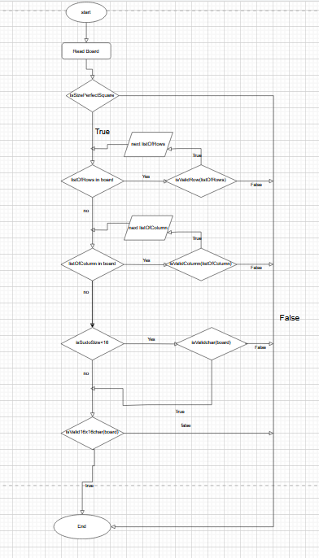
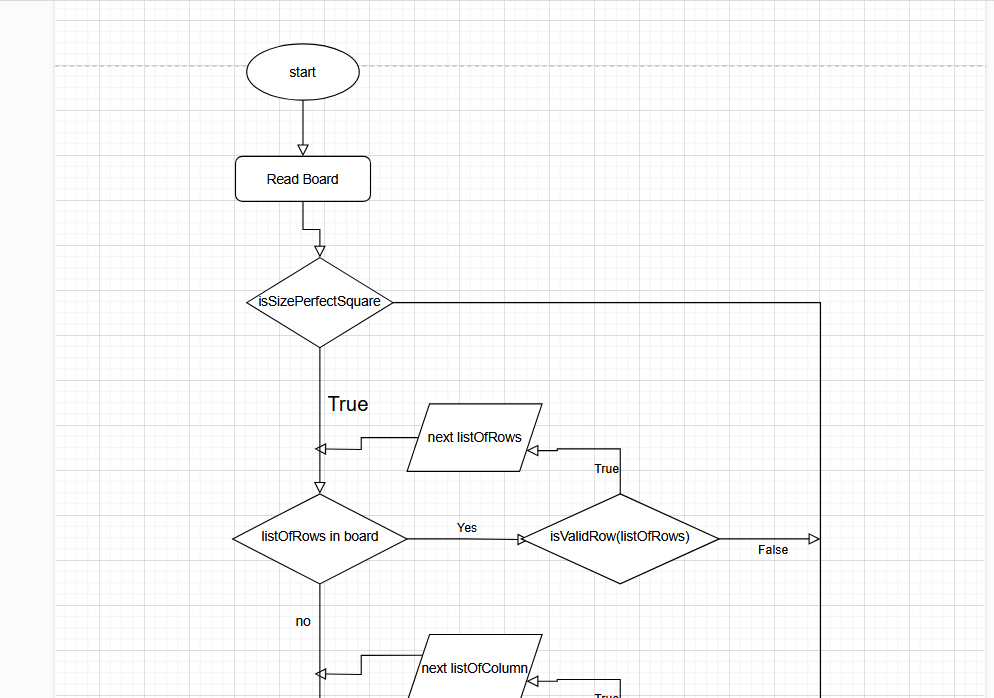
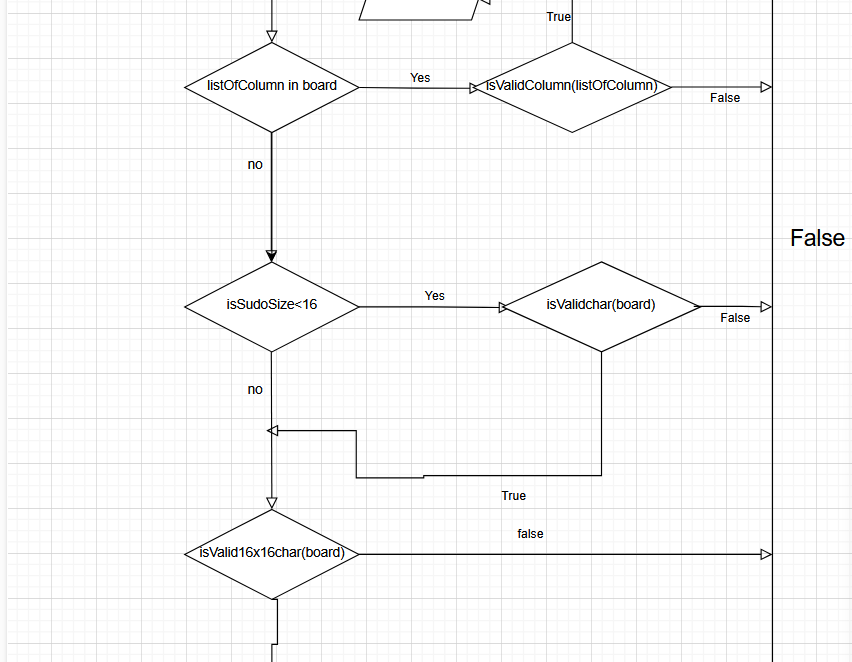
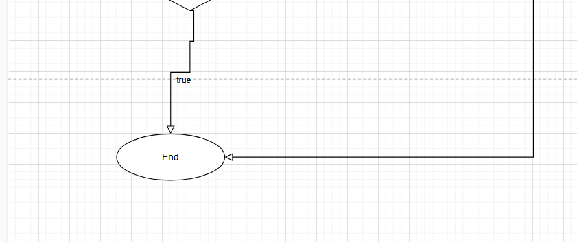

# Sudoku Validator (Kotlin)

  
*Complete validation workflow*

A robust Kotlin implementation to validate Sudoku boards of various sizes, with comprehensive rule checking.

## Features

### Multi-Size Support
- Validates N×N boards where N is a perfect square (4, 9, 16, etc.)
- Automatically adapts validation rules based on board size

### Comprehensive Rule Checks
 
- **Row validation**: No duplicates in any row
- **Column validation**: No duplicates in any column
- **Character validation**: 
  - 1-9 for standard Sudoku (≤9×9)
  - 1-9 and A-G for 16×16 variants

